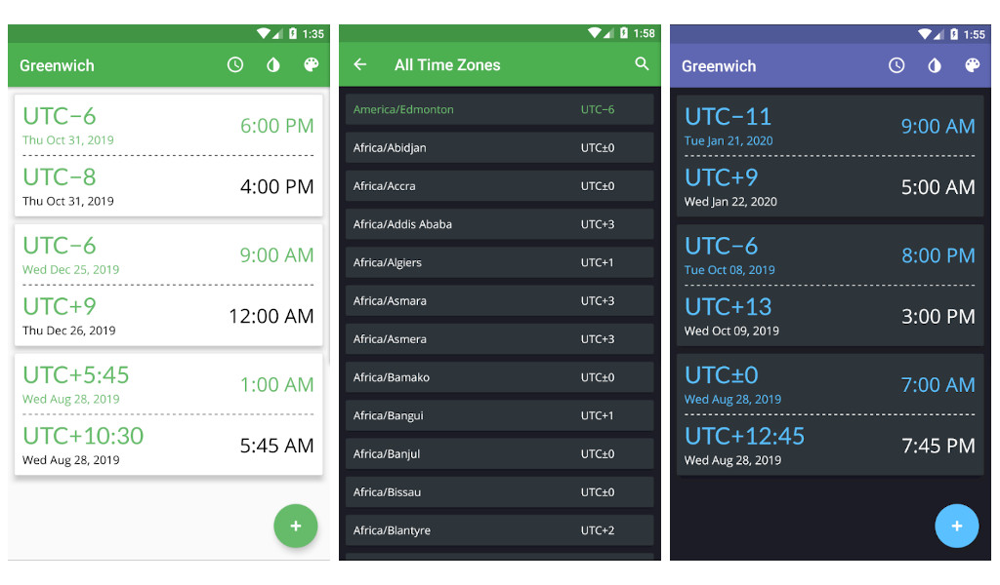

# Greenwich

## Features
- Conversion of dates/times to other time zones
- Lists all time zones and their corresponding UTC offsets
- Preloaded and custom themes
- Swipe to delete
- Drag and drop to re-order 

## Acknowledgements
- Themes from [Cyanea](https://github.com/jaredrummler/Cyanea)
- Swipe to delete + drag and drop uses [FastAdapter](https://github.com/mikepenz/FastAdapter)
- Time conversion handled by [JodaTime](https://www.joda.org/joda-time/)
- Serializing JodaTime objects uses [gson-jodatime-serializers](https://github.com/gkopff/gson-jodatime-serialisers)
